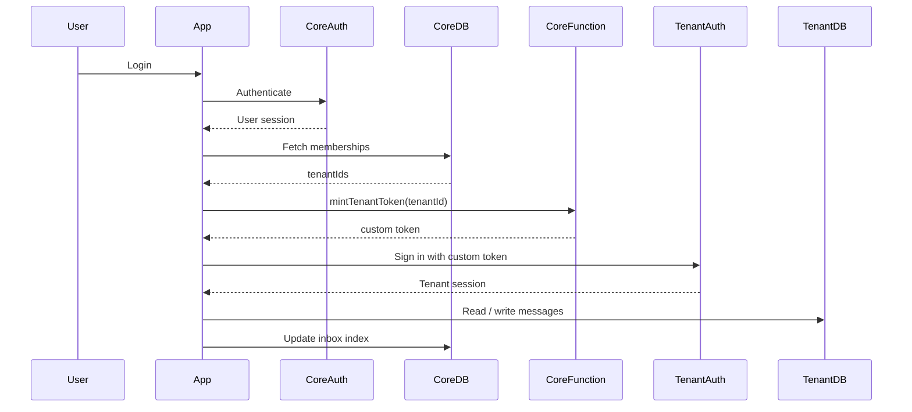
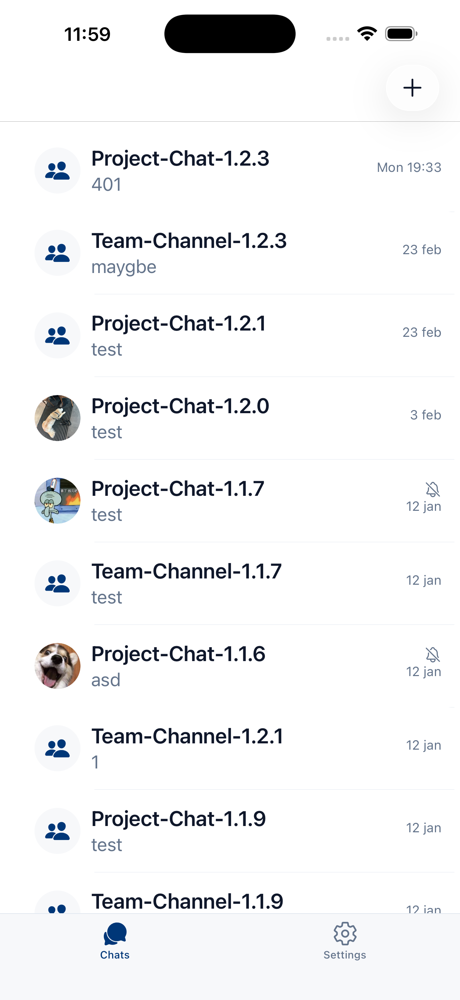
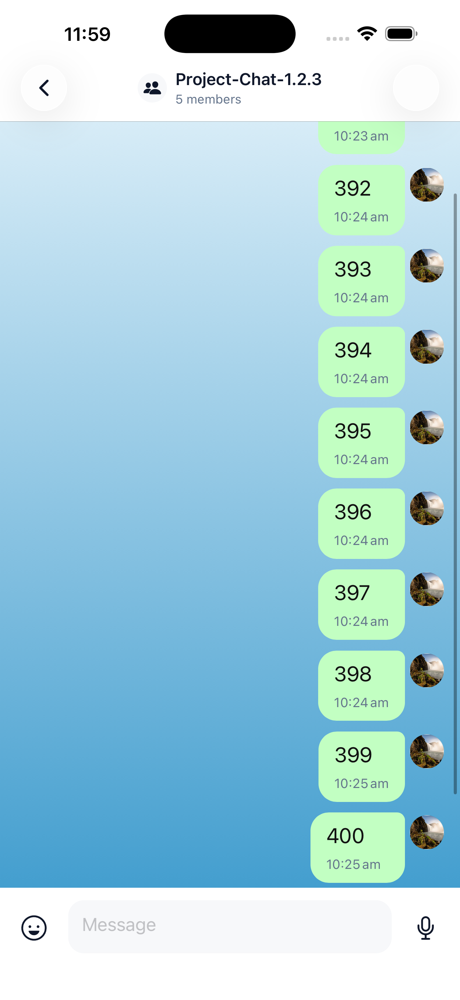

# Multi-Tenant Chat System (Firebase) — Architecture & Design

> ⚡ A real-world, Slack-like chat system designed with a scalable multi-tenant architecture using Firebase.

---

## 🚀 Overview

This project documents the architecture of a **multi-tenant chat platform** built with:

- React Native (Expo)
- Firebase (Auth, Firestore, Cloud Functions)

The system originally started as a **single Firebase project** and was later redesigned to support **multiple tenants (companies)** with proper isolation, scalability, and minimal disruption to existing users.

---

## 🧩 Problem

The original single-project architecture introduced several limitations:

- Tight coupling between different companies (no data isolation)
- Scalability concerns as data volume increased
- Difficulty supporting multi-company collaboration
- Risky full migration requirements

The challenge was to evolve into a **multi-tenant system** without:

- breaking existing users  
- performing large-scale data migration  
- increasing frontend complexity  

---

## 🏗️ Architecture Overview
```text
┌──────────────────────────────┐
│        Client App            │
│  (React Native / Web)       │
└──────────────┬───────────────┘
               │
               ▼
┌──────────────────────────────┐
│    Core Firebase Project     │
│                              │
│  • Auth (Single Identity)    │
│  • Firestore (Core Data)     │
│  • Inbox Index               │
│  • Cloud Functions           │
│    (Token Minting)           │
└──────────────┬───────────────┘
               │
               ▼
┌──────────────────────────────┐
│   Tenant Firebase Projects   │
│     (Per Company)            │
│                              │
│  • Firestore (Messages)      │
│  • Storage (Media)           │
│  • RTDB (Presence/Typing)    │
└──────────────────────────────┘
```
## 🔄 Sequence Flow (Login → Tenant Access)


### Key Idea

> This design separates identity, indexing, and data storage concerns, enabling horizontal scaling across tenants without coupling client logic to multiple backends.

- **Core project** = identity + global index  
- **Tenant projects** = isolated data per company  

---

## 🔄 Data Flow (Tenant Access)

1. User signs in via **Core Firebase Auth**
2. App reads `/coreMemberships/{uid}`
3. Determines accessible tenants
4. Calls Cloud Function: `mintTenantToken(tenantId)`
5. Receives Firebase custom token
6. Signs into tenant Firebase project (same UID)
7. Reads/writes tenant data:
   - channels
   - messages
8. Updates Core inbox index:
   - `/coreUserInboxes/{uid}`

---

## 🧠 Key Highlights

- Designed a multi-tenant architecture using **isolated Firebase projects with shared identity**
- Built a **Core inbox indexing system** for unified channel listing
- Implemented **token-based tenant authentication** via Cloud Functions
- Designed a **bridge-ready architecture for cross-tenant communication**
- Migrated from legacy system using **incremental strategy (no full rewrite)**

---

## ⚖️ Key Design Decisions

### Core Inbox Index
Avoid querying multiple Firebase projects from the client  
→ Enables **single-query channel list (O(1))**

### Token-Based Tenant Access
Maintain a unified user identity across projects  
→ Simplifies authentication and permissions

### Incremental Migration Strategy
Avoid risky full data migration  
→ Supports gradual rollout and legacy compatibility

---

## ⚠️ Trade-offs

- Increased backend complexity (multi-project + token system)
- Slight delay when entering tenant (auth bootstrap)
- Requires strict consistency between Core and Tenant data

These trade-offs were accepted to achieve:

- scalability  
- tenant isolation  
- enterprise readiness  

---

## 📱 UI Context (Reference Only)

These screenshots provide context for how the system maps to real user interactions.

### Unified Inbox (Core Index)



### Chat Thread (Tenant/Core Routing)



---

## 📚 Documentation

- [Architecture](./docs/architecture.md)
- [Firebase Backend](./docs/firebase-backend.md)
- [Frontend](./docs/frontend.md)
- [Personal Engineering Summary](./docs/personal-summary.md)

---

## ⚙️ Tech Stack

**Frontend**
- React Native (Expo)
- Expo Router

**Backend**
- Firebase Auth
- Firestore
- Cloud Functions
- Realtime Database (presence / typing)

---

## 📊 Context

- Supports real-time messaging with presence and typing indicators
- Multi-tenant isolation via separate Firebase projects
- Token-based authentication enables seamless cross-project identity
- Core inbox index enables O(1) channel list query

---

## ⚠️ Disclaimer

This repository contains **architecture and design documentation only**.

- No proprietary company code is included  
- No sensitive data is exposed  

---

## 👤 Author

Mobile Engineer specializing in:

- real-time chat systems  
- multi-tenant architecture  
- React Native + Firebase ecosystems  
